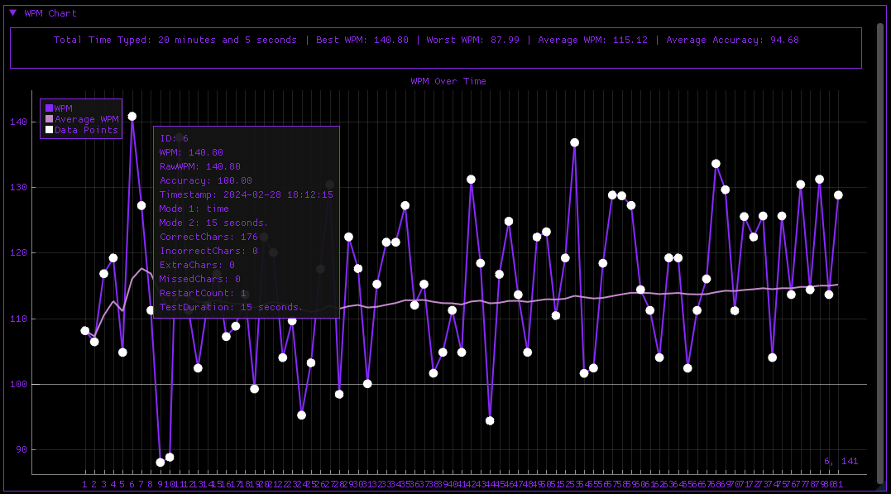

# MonkeyType Performance Visualizer

## Overview
The MonkeyType Performance Visualizer is a desktop application designed to fetch, display, and analyze typing test data over time. It visualizes metrics such as Words Per Minute (WPM), accuracy, and test duration, providing users with insights into their typing performance and progress.

## Features
- **Real-time Data Fetching**: Automatically retrieves typing test data from the MonkeyType API every 5 seconds.
- **Data Visualization**: Plots WPM and accuracy over time using an interactive graph.
- **Performance Metrics**: Displays total typing time, best and worst WPM, average WPM, and accuracy.
- **Database Storage**: Persistently stores test results in a local SQLite database for historical analysis.

## Prerequisites
Before running the application, ensure you have the following installed:
- CMake (for building the project)
- cURL (for fetching data from the API)
- SQLite3 (for local database storage)
- Dear ImGui and ImPlot (for the graphical user interface)
- nlohmann/json (for JSON parsing)

## Installation

### Step 1: Clone the Repository
```bash
git clone https://github.com/JoonJR/MonkeyTypeAPI_Project.git
```
### Step 2: Install Dependencies
```bash
Installing vcpkg and curl 

git clone https://github.com/Microsoft/vcpkg.git
cd vcpkg
./bootstrap-vcpkg.sh
./vcpkg integrate install
vcpkg install curl[tool]

// Installing json
vcpkg install nlohmann-json

// Installing Dear ImGUI and ImPlot 
./vcpkg install imgui
./vcpkg install implot

// Installing SQLite3
./vcpkg install sqlite3[tool]
```
### Step 3: Configure Visual Studio
#### Include Directories
Project Properties -> Configuration Properties -> VC++ Directioris -> Include Directories > include path to C:\path\to\vcpkg\installed\x64-windows\include
#### Library Directories
Project Properties -> Configuration Properties -> Library Directories -> Add path to lib directory of cURL C:\path\to\vcpkg\installed\x64-windows\lib
#### Additional Dependencies
Project properties -> Linker -> Input -> Additional Dependencies -> add libcurl.lib to the list


## Usage

### Running the application

Execute the compiled application. The graphical interface will launch, immediately beginning to fetch and display typing test data.

### Interacting with the Visualization
*Hover over data points in the graph to see detailed metrics for specific tests.
*Observe the running average line to gauge overall performance trends.

## Configuration 
To connect to your MonkeyType account, set your API key in your environment variables under APEKEY. The application fetches data using this key.
